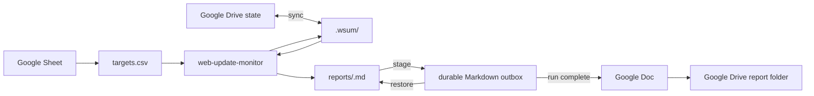

# wsum

Local-first Agent Skills for detecting meaningful updates on public websites and documents.

The core skill lives in `skills/web-update-monitor/`. It intentionally has two runtime helpers: `workspace.py` owns CSV/state/report orchestration, while `monitor.py` owns safe fetching, normalization, hashing, and bounded diffing. The agent edits the target list, judges whether a detected change matters, and composes report sections for material changes. All material changes finalized from one check run are aggregated into a single Markdown report.

A thin composite integration skill lives in `skills/web-update-monitor-google-workspace/`. It keeps Google-specific orchestration outside the core while using Google Sheets as the target source, Google Drive for cross-run state, and Google Docs for completed report delivery.

## Agent Skills

The repository ships these canonical skills:

- `skills/web-update-monitor/`: the local-first core monitor with its `SKILL.md`, bundled scripts, requirements, and example CSV.
- `skills/web-update-monitor-google-workspace/`: a connector-driven composite skill that projects a Google Sheet into the core CSV contract, persists core state in Drive, and publishes completed runs as Google Docs.

To install the core skill in an Agent Skills-compatible runtime, use the `web-update-monitor` package from a published GitHub release or from the `agent-skills` artifact of a successful [Package agent skills workflow run](https://github.com/dceoy/wsum/actions/workflows/agent-skills-package.yml?query=branch%3Amain). To use the Google Workspace composite, install **both** `web-update-monitor` and `web-update-monitor-google-workspace`; the composite package intentionally delegates to the core package instead of duplicating its runtime helpers.

### Google Workspace composition



The core automatically reads newly added navigation links from changed HTML pages and RSS/Atom feeds, including linked PDFs, at depth 1. It stores child evidence in the parent pending transaction and includes it in the same semantic review. Initial observations establish the parent baseline without following existing links.

The core exposes resumable pending reviews directly. `check --compact` returns small review handles, `pending --target-id` returns one bounded parent diff plus linked-document evidence on demand, and a target with an existing pending review is not refetched. The Google Workspace composite therefore persists the core `.wsum/` state directly instead of duplicating review metadata in an adapter-owned journal.

Markdown remains the canonical core report and durable outbox format. The composite waits until a run has no pending reviews, then creates or updates one Google Doc named `Web Update Report — <run-id>` in the configured report folder. Exact-title lookup makes retries converge on the same Doc instead of creating duplicates.

Read `skills/web-update-monitor-google-workspace/SKILL.md` for connector orchestration and recovery semantics.

## Workspace

Use a local folder with a `targets.csv` file. A template is available at `skills/web-update-monitor/examples/targets.csv`.

```csv
name,url,watch_focus,enabled
OpenAI Pricing,https://openai.com/api/pricing/,Pricing and plan changes,true
Anthropic News,https://www.anthropic.com/news,Important product announcements,true
```

Columns:

- `name`: required display name.
- `url`: required public HTTP(S) URL.
- `watch_focus`: optional natural-language description of meaningful changes.
- `enabled`: optional `true` or `false`; blank defaults to `true`.

`target_id` is intentionally not user-facing. It is derived deterministically from the URL.

The workspace evolves into:

```text
workspace/
├── targets.csv
├── reports/
└── .wsum/
    ├── snapshots/
    └── pending/
        └── <target-id>/
            ├── state.json
            └── candidate.txt
```

Users may edit `targets.csv` when using the core skill directly. In the Google Workspace composite workflow, regenerate it from the authoritative Spreadsheet instead. `.wsum/` is internal state and should not be edited manually.

### Generated files

The workspace contains one user-facing input, user-facing reports, and internal state:

- `targets.csv`: the user-facing source of truth for monitored targets in the core workflow. The agent may create or edit it when the user changes monitoring configuration. Composite integrations may generate it from an external authoritative source.
- `reports/<run-id>.md`: the user-facing output. One report is created per `check` run only when at least one material change is finalized. The run ID has the form `YYYYMMDDTHHMMSSZ-xxxxxxxx`. Material targets from the same run are merged into this file.
- `.wsum/snapshots/<target-id>.txt`: the accepted normalized baseline for each target. A first observation creates it; later finalized observations replace it atomically, including non-material changes.
- `.wsum/pending/<target-id>/candidate.txt`: the normalized changed candidate awaiting semantic review.
- `.wsum/pending/<target-id>/state.json`: review transaction state linking the candidate to its run, revision, expected baseline hash, candidate hash, diff-truncation status, and bounded linked-document evidence or individual child errors.

Each `.wsum/pending/<target-id>/` directory is one uncommitted review transaction. It survives the `check` → review → `finalize` boundary and is removed as a directory after successful finalization. `.wsum/snapshots/` is the only internal state that persists across completed transactions.

Reviews created with the previous `.wsum/pending/<target-id>.json` and `.wsum/candidates/<target-id>.txt` layout remain finalizable after an upgrade; new transactions use the grouped directory layout.

The helper may briefly create hidden `*.tmp` files next to the report, snapshot, or pending-state file being replaced. Keeping these temporary files in the destination directory preserves same-filesystem atomic replacement; they are not collected under a shared `.wsum/tmp/`.

## Agent workflow

Read `skills/web-update-monitor/SKILL.md` for the complete core procedure. At a high level, the agent edits `targets.csv` when requested, checks enabled targets, reviews bounded parent diffs and newly linked document contents for materiality, and contributes each material target to one run-level Markdown report. The helper handles deterministic state transitions and per-target errors.

## Deterministic workspace facade

For development or agent orchestration, run:

```bash
python skills/web-update-monitor/scripts/workspace.py \
  --workspace /path/to/workspace check --compact
```

The compact form keeps batch output small. Existing pending targets are returned as review handles without refetching, while unrelated targets continue normally. Fetch one pending review's bounded diff on demand:

```bash
python skills/web-update-monitor/scripts/workspace.py \
  --workspace /path/to/workspace pending --target-id <target-id>
```

After the agent decides whether a change is material, it passes an internal decision to:

```bash
python skills/web-update-monitor/scripts/workspace.py \
  --workspace /path/to/workspace finalize < decision.json
```

The facade verifies the review revision, promotes the candidate snapshot, merges material target sections into `reports/<run-id>.md` only after successful promotion, and clears pending state. Multiple material targets from the same check run therefore produce one report file. If report persistence fails after promotion, retain the pending state and retry. A truncated parent diff or incomplete linked evidence cannot be finalized as non-material; it stops for manual review instead. Child failures do not fail the parent check or other targets. New links are bounded to 20 per target, 60 seconds of fetching, 2 MiB per child / 10 MiB total fetched content, and 8 KiB per child / 64 KiB total review text. Existing public-IP, redirect, normalization, and credential checks apply to child requests. No additional CSV columns or persistent link sidecars are needed: destination hashes already advance atomically with accepted parent snapshots.

## Development and validation

Set up the repository with:

```bash
uv sync
```

Then run tests and validate the canonical skills with the [Agent Skills reference validator](https://github.com/agentskills/agentskills/tree/main/skills-ref):

```bash
uv run pytest
skills-ref validate skills/web-update-monitor
skills-ref validate skills/web-update-monitor-google-workspace
```

`monitor.py` can fetch a public HTTP(S) URL or normalize a supplied local/rendered document. `workspace.py` validates targets and owns pending review transactions, safe report writing, and atomic snapshot promotion.

Browser-rendered targets are outside the CSV workspace workflow. Do not auto-escalate a static failure to browser rendering. Use browser input only when the browser tool can enforce public-unicast egress, bounded redirects and subresources, a total timeout, and a maximum artifact size. Never provide cookies or credentials.

## Repository boundary

Do not commit fetched production content, `targets.csv`, snapshots, reports, `.wsum/`, credentials, browser profiles, or other deployment data.
