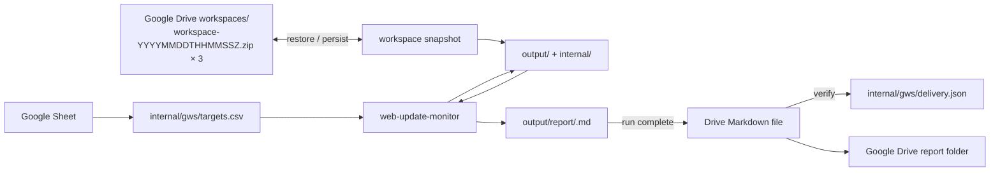
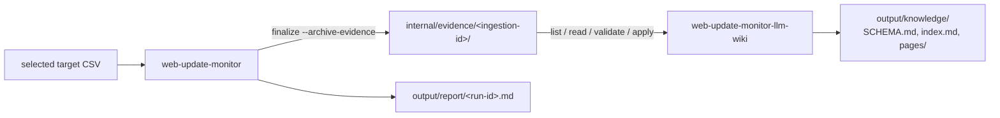

# wsum

Local-first Agent Skills for detecting meaningful updates on public websites and documents.

The core skill lives in `skills/web-update-monitor/`. It intentionally has two runtime helpers: `workspace.py` owns target CSV validation, state, and report orchestration, while `monitor.py` owns safe fetching, normalization, hashing, and bounded diffing. The target CSV path is passed explicitly to the core and is independent of the workspace used for state and reports. The agent edits the selected target list, judges whether a detected change matters, and composes report sections for material changes. All material changes finalized from one check run are aggregated into a single Markdown report.

A second composite, `skills/web-update-monitor-llm-wiki/`, compiles durable captured evidence from the core into a source-backed Markdown knowledge base. The core also gains an opt-in `finalize --archive-evidence` output for it.

A thin composite integration skill lives in `skills/web-update-monitor-gws/`. It keeps Google-specific orchestration outside the core while using Google Sheets as the target source and Google Drive for complete versioned workspace persistence plus completed Markdown report delivery.

## Agent Skills

The repository ships these canonical skills:

- `skills/web-update-monitor/`: the local-first core monitor with its `SKILL.md`, bundled scripts, requirements, and example CSV.
- `skills/web-update-monitor-gws/`: a connector-driven composite skill that projects a Google Sheet into the core CSV contract, persists the complete `output/` and `internal/` workspace roots as three retained timestamped ZIP generations in Drive, and publishes completed runs as Markdown files in Drive.
- `skills/web-update-monitor-llm-wiki/`: a composite skill with one deterministic helper (`scripts/wiki.py`) that turns committed evidence bundles into cited Markdown pages with a processed ledger and recoverable compilation transactions.

To install the core skill in an Agent Skills-compatible runtime, use the `web-update-monitor` package from a published GitHub release or from the `agent-skills` artifact of a successful [Package agent skills workflow run](https://github.com/dceoy/wsum/actions/workflows/agent-skills-package.yml?query=branch%3Amain). To use the Google Workspace composite, install **both** `web-update-monitor` and `web-update-monitor-gws`; the composite package intentionally delegates to the core package instead of duplicating its runtime helpers. The LLM wiki composite follows the same rule: install `web-update-monitor` and `web-update-monitor-llm-wiki`, and let the runtime's skill discovery locate the core instead of assuming a sibling path.

### Google Workspace composition



The core automatically reads newly added navigation links from changed HTML pages and RSS/Atom feeds, including linked PDFs. Traversal defaults to depth 1 and at most 100 fetched links per target; `check --link-depth <N> --max-links <N>` changes those run-level limits, and depth 0 disables linked-document fetching. It stores child evidence in the parent pending transaction and includes it in the same semantic review. Initial observations establish the parent baseline without following existing links.

The core groups interests by exact trimmed URL and fetches each enabled URL once. Semantic review considers the parent diff and linked evidence for every enabled interest: material for any interest means material for the URL. Write one managed report section explaining the affected interests without repeating the same change, and finalize once per URL.

The core exposes resumable pending reviews directly. `check --compact` returns small review handles, `pending --target-id` returns one bounded parent diff plus linked-document evidence on demand, and a target with an existing pending review is not refetched. The Google Workspace composite persists the complete `output/` and `internal/` roots as timestamped workspace snapshots (`workspace-YYYYMMDDTHHMMSSZ.zip`), restores the newest generation by filename timestamp, and retains only the three newest committed snapshots. This includes reports, core state, evidence, the cached Google Sheets projection, and a compact delivery ledger; after restore, the Sheet projection is regenerated before pending reconciliation or new fetches.

Markdown remains the canonical core and user-facing Google Drive report format. Because each committed workspace snapshot already contains the complete `output/` tree, the composite delivers completed `output/report/<run-id>.md` files directly without duplicating report content into a queue. A single `internal/gws/delivery.json` ledger stores only delivered run IDs and report SHA-256 digests, so completed historical reports are skipped without Drive calls. Pending delivery still uses exact-filename lookup plus byte verification to make retries converge on the same Drive file instead of creating duplicates.

Read `skills/web-update-monitor-gws/SKILL.md` for connector orchestration and recovery semantics.

For **Claude Code Routines**, first check actual Google Sheets range reads and Google Drive binary ZIP create/download/verification, and configure public-network access. The Google Workspace composite includes a deterministic local Python helper for Sheet-to-CSV projection, safe ZIP snapshot pack/verify/restore, generation naming, and delivery-ledger validation (`skills/web-update-monitor-gws/scripts/gws.py`). Google connector transfer and authorization remain the agent's responsibility. Run the [Routines E2E compatibility checklist](docs/claude-code-routines.md) before enabling a recurring schedule; this integration has not been verified against a live Routine.


### LLM wiki composition



Detection, semantic materiality review, and one report per run stay in the core. With `finalize --archive-evidence`, a material decision also commits **captured evidence**: the complete normalized parent candidate, the bounded diff, exactly the retained linked-document excerpts with their completeness flags, digests, the enabled-interest context, and a commit receipt. The archive obligation is part of the core's existing recoverable finalization: a versioned intent freezes the decision, evidence is staged, the snapshot and report are applied, and `committed.json` is published last. `check`, `discard`, pending replacement, and later finalizations recover an outstanding intent first, so a crash can neither erase the only evidence nor leave an accepted snapshot without it. Ordinary `finalize` and the Google Workspace composite are unchanged unless they opt in.

The wiki composite compiles that evidence asynchronously, one ingestion at a time, using the agent for routing and synthesis and `wiki.py` for deterministic work: listing digest-verified bundles in stable order, bounded line-range reads, draft validation (schema, paths, links, citations that resolve to verified evidence, expected hashes), a write-ahead transaction, a processed ledger, an exclusive lock, and replay recovery. Version 1 is update-driven (first observations do not seed the wiki), never prunes evidence automatically, and does not support page deletion or renaming. Hashes prove integrity, not authenticity or factual truth, and semantic source-support review remains the agent's responsibility.

Read `skills/web-update-monitor-llm-wiki/SKILL.md` for the compilation workflow, draft format, limits, and the explicit conflict reconciliation procedure.

## Workspace

Pass the target CSV and the state/report workspace as separate inputs. The CSV may have any filename and may live outside the workspace. Relative `--targets` paths are resolved from the process working directory. A template is available at `skills/web-update-monitor/examples/targets.csv`.

```bash
python skills/web-update-monitor/scripts/workspace.py \
  --workspace /path/to/workspace --targets /path/to/monitored-sites.csv check --compact
```

There is no implicit `workspace/targets.csv` lookup: `check` requires `--targets`. `pending` may omit it only to inspect or recover a saved review, and a new `finalize --archive-evidence` requires the currently selected CSV. State and report files remain under `--workspace`.

```csv
name,url,publisher,category,keywords,criteria,priority,enabled
Subscription updates,https://vendor.example/updates,Example Vendor,Product,subscription plans,Report changes to plan availability and limits,1,true
Integration updates,https://vendor.example/updates,Example Vendor,Product,API integrations,Report breaking integration changes,2,true
Service notices,https://operator.example/notices,Example Operator,Operations,,Report changes to maintenance schedules,2,true
Technical publications,https://institute.example/publications,Example Institute,Research,technical reports,,,false
```

These synthetic reserved example-domain URLs illustrate four interests and three URL targets; they are not live-fetch fixtures or monitoring recommendations. A check fetches the two enabled URL targets once each and reviews both enabled interests on the shared URL.

Each CSV row defines an interest. `name` and `url` are required; optional fields are `publisher`, `category`, `keywords`, `criteria`, `priority`, and `enabled`. Repeated exact URLs share one fetch and review while retaining every row's metadata. A URL is monitored when any interest is enabled, and a change is material when it matters to any enabled interest.

Use `criteria` to describe report-worthy changes and `keywords` as semantic hints. Priority is a positive integer used for display; blank enabled values default to true. The core rejects unknown or duplicate headers, invalid rows, and whole-cell ditto values. See [the core CSV contract](skills/web-update-monitor/SKILL.md#workspace) for the complete parsing and validation rules. Never include credentials or secrets.

The workspace separates user-facing artifacts from implementation data at the root. The selected target CSV is a separate input:

```text
workspace/
├── output/
│   └── report/
└── internal/
    ├── state/
    │   ├── snapshots/
    │   ├── pending/
    │   │   └── <target-id>/
    │   │       ├── state.json
    │   │       └── candidate.txt
    │   └── recovery/
    └── evidence/
```

Users normally read only `output/`; `internal/` is managed by the skills and should not be edited manually. Edit the selected CSV when changing core monitoring targets. In the Google Workspace composite workflow, the authoritative Spreadsheet projects to `$WORKSPACE/internal/gws/targets.csv`, which is passed explicitly to the core.

### Generated files

- `output/report/<run-id>.md`: one Markdown report per check run with material changes.
- `internal/state/snapshots/<target-id>.txt`: the accepted normalized baseline.
- `internal/state/pending/<target-id>/`: the candidate and review context retained until finalization.
- `internal/state/recovery/`: durable transaction records for interrupted writes.
- `internal/evidence/<ingestion-id>/`: optional captured evidence and commit receipt for wiki compilation.

The core owns internal files and uses temporary files beside their destinations for atomic replacement. See [the core skill](skills/web-update-monitor/SKILL.md) for schema, limits, and recovery details.

## Agent workflow

Read `skills/web-update-monitor/SKILL.md` for the complete core procedure. At a high level, the agent edits the selected target CSV when requested, passes its path to the core, checks enabled targets, reviews bounded parent diffs and newly linked document contents for materiality, and contributes each material target to one run-level Markdown report. The helper handles deterministic state transitions and per-target errors.

## Deterministic workspace facade

For development or agent orchestration, run:

```bash
python skills/web-update-monitor/scripts/workspace.py \
  --workspace /path/to/workspace --targets /path/to/monitored-sites.csv check --compact
```

The compact form keeps batch output small. Existing pending targets are returned as review handles without refetching, while unrelated targets continue normally. Fetch one pending review's bounded diff on demand:

```bash
python skills/web-update-monitor/scripts/workspace.py \
  --workspace /path/to/workspace --targets /path/to/monitored-sites.csv \
  pending --target-id <target-id>
```

Before semantic judgment or automated finalization, validate the current configuration. Full pending reviews replace stored interests with the complete current enabled-interest collection without rewriting candidate bytes, hashes, revision, original run ID, or diff/link evidence and without refetching. Valid removed/all-disabled URL groups expose no active interests and must be discarded through the core API; `check` performs that reconciliation automatically. Missing/invalid configuration makes `check` fail before fetching or configuration-driven mutation. `pending` remains available for inspection and recovery with the saved current-format context.

After the agent decides whether a change is material for any enabled interest, it passes an internal decision to:

```bash
python skills/web-update-monitor/scripts/workspace.py \
  --workspace /path/to/workspace --targets /path/to/monitored-sites.csv \
  finalize < decision.json
```

The facade verifies the review revision, promotes the candidate snapshot, merges material target sections into `output/report/<run-id>.md` only after successful promotion, and clears pending state. Multiple material targets from the same check run therefore produce one report file. If report persistence fails after promotion, retain the pending state and retry. A truncated parent diff or incomplete linked evidence cannot be finalized as non-material; it stops for manual review instead. Child failures do not fail the parent check or other targets. New links are traversed breadth-first at depth 1 by default, bounded to 100 fetched links per target by default, 60 seconds of fetching, 2 MiB per child / 10 MiB total fetched content, and 8 KiB per child / 64 KiB total review text. `--link-depth` changes the traversal depth and `--max-links` changes the fetched-link cap from 1 through 100. Existing public-IP, redirect, normalization, and credential checks apply to child requests. No additional CSV columns or persistent link sidecars are needed: destination hashes already advance atomically with accepted parent snapshots.

## Development and validation

Set up the repository with:

```bash
uv sync
```

Then run tests and validate the canonical skills with the [Agent Skills reference validator](https://github.com/agentskills/agentskills/tree/main/skills-ref):

```bash
uv run pytest
skills-ref validate skills/web-update-monitor
skills-ref validate skills/web-update-monitor-gws
skills-ref validate skills/web-update-monitor-llm-wiki
```

`monitor.py` can fetch a public HTTP(S) URL or normalize a supplied local/rendered document. `workspace.py` validates targets and owns pending review transactions, safe report writing, atomic snapshot promotion, and optional evidence archival. `skills/web-update-monitor-llm-wiki/scripts/wiki.py` owns wiki validation, ledger, and recovery. Every runtime helper is included in the 100% branch-coverage gate.

Browser-rendered targets are outside the CSV workspace workflow. Do not auto-escalate a static failure to browser rendering. Use browser input only when the browser tool can enforce public-unicast egress, bounded redirects and subresources, a total timeout, and a maximum artifact size. Never provide cookies or credentials.

## Repository boundary

Do not commit operational target CSV files (regardless of filename), fetched production content, `output/`, `internal/`, credentials, browser profiles, or other deployment data. The example CSV is tracked documentation data.
