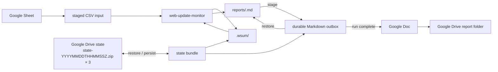
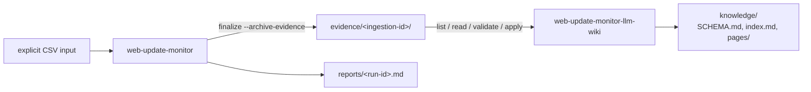

# wsum

Local-first Agent Skills for detecting meaningful updates on public websites and documents.

The core skill lives in `skills/web-update-monitor/`. It intentionally has two runtime helpers: `workspace.py` accepts an explicit CSV target input and owns state/report orchestration, while `monitor.py` owns safe fetching, normalization, hashing, and bounded diffing. The agent edits the target list, judges whether a detected change matters, and composes report sections for material changes. All material changes finalized from one check run are aggregated into a single Markdown report.

A second composite, `skills/web-update-monitor-llm-wiki/`, compiles durable captured evidence from the core into a source-backed Markdown knowledge base. The core also gains an opt-in `finalize --archive-evidence` output for it.

A thin composite integration skill lives in `skills/web-update-monitor-gws/`. It keeps Google-specific orchestration outside the core while using Google Sheets as the target source, Google Drive for cross-run state, and Google Docs for completed report delivery.

## Agent Skills

The repository ships these canonical skills:

- `skills/web-update-monitor/`: the local-first core monitor with its `SKILL.md`, bundled scripts, requirements, and example CSV.
- `skills/web-update-monitor-gws/`: a connector-driven composite skill that projects a Google Sheet into the core CSV contract, persists core state as three retained timestamped ZIP generations in Drive, and publishes completed runs as Google Docs.
- `skills/web-update-monitor-llm-wiki/`: a composite skill with one deterministic helper (`scripts/wiki.py`) that turns committed evidence bundles into cited Markdown pages with a processed ledger and recoverable compilation transactions.

To install the core skill in an Agent Skills-compatible runtime, use the `web-update-monitor` package from a published GitHub release or from the `agent-skills` artifact of a successful [Package agent skills workflow run](https://github.com/dceoy/wsum/actions/workflows/agent-skills-package.yml?query=branch%3Amain). To use the Google Workspace composite, install **both** `web-update-monitor` and `web-update-monitor-gws`; the composite package intentionally delegates to the core package instead of duplicating its runtime helpers. The LLM wiki composite follows the same rule: install `web-update-monitor` and `web-update-monitor-llm-wiki`, and let the runtime's skill discovery locate the core instead of assuming a sibling path.

### Google Workspace composition



The core automatically reads newly added navigation links from changed HTML pages and RSS/Atom feeds, including linked PDFs. Traversal defaults to depth 1 and at most 100 fetched links per target; `check --link-depth <N> --max-links <N>` changes those run-level limits, and depth 0 disables linked-document fetching. It stores child evidence in the parent pending transaction and includes it in the same semantic review. Initial observations establish the parent baseline without following existing links.

The core groups interests by exact trimmed URL and fetches each enabled URL once. Semantic review considers the parent diff and linked evidence for every enabled interest: material for any interest means material for the URL. Write one managed report section explaining the affected interests without repeating the same change, and finalize once per URL.

The core exposes resumable pending reviews directly. `check --compact` returns small review handles, `pending --target-id` returns one bounded parent diff plus linked-document evidence on demand, and a target with an existing pending review is not refetched. The Google Workspace composite persists the core `.wsum/` state and durable Markdown outbox as timestamped ZIP generations (`state-YYYYMMDDTHHMMSSZ.zip`), restores the newest generation by filename timestamp, and retains only the three newest committed archives instead of duplicating review metadata in an adapter-owned journal or allowing state archives to accumulate.

Markdown remains the canonical core report and durable outbox format. The composite waits until a run has no pending reviews, then creates or updates one Google Doc named `Web Update Report — <run-id>` in the configured report folder. Exact-title lookup makes retries converge on the same Doc instead of creating duplicates.

Read `skills/web-update-monitor-gws/SKILL.md` for connector orchestration and recovery semantics.

### LLM wiki composition



Detection, semantic materiality review, and one report per run stay in the core. With `finalize --archive-evidence`, a material decision also commits **captured evidence**: the complete normalized parent candidate, the bounded diff, exactly the retained linked-document excerpts with their completeness flags, digests, the enabled-interest context, and a commit receipt. The archive obligation is part of the core's existing recoverable finalization: a versioned intent freezes the decision, evidence is staged, the snapshot and report are applied, and `committed.json` is published last. `check`, `discard`, pending replacement, and later finalizations recover an outstanding intent first, so a crash can neither erase the only evidence nor leave an accepted snapshot without it. Ordinary `finalize` and the Google Workspace composite are unchanged unless they opt in.

The wiki composite compiles that evidence asynchronously, one ingestion at a time, using the agent for routing and synthesis and `wiki.py` for deterministic work: listing digest-verified bundles in stable order, bounded line-range reads, draft validation (schema, paths, links, citations that resolve to verified evidence, expected hashes), a write-ahead transaction, a processed ledger, an exclusive lock, and replay recovery. Version 1 is update-driven (first observations do not seed the wiki), never prunes evidence automatically, and does not support page deletion or renaming. Hashes prove integrity, not authenticity or factual truth, and semantic source-support review remains the agent's responsibility.

Read `skills/web-update-monitor-llm-wiki/SKILL.md` for the compilation workflow, draft format, limits, and the explicit conflict reconciliation procedure.

## Workspace

Choose a local workspace for state/output and pass the target CSV explicitly to the core. The CSV may use any filename or location; `skills/web-update-monitor/examples/targets.csv` is only a template.

```csv
name,url,publisher,category,keywords,criteria,priority,enabled
Subscription updates,https://vendor.example/updates,Example Vendor,Product,subscription plans,Report changes to plan availability and limits,1,true
Integration updates,https://vendor.example/updates,Example Vendor,Product,API integrations,Report breaking integration changes,2,true
Service notices,https://operator.example/notices,Example Operator,Operations,,Report changes to maintenance schedules,2,true
Technical publications,https://institute.example/publications,Example Institute,Research,technical reports,,,false
```

These synthetic reserved example-domain URLs illustrate four interests and three URL targets; they are not live-fetch fixtures or monitoring recommendations. A check fetches the two enabled URL targets once each and reviews both enabled interests on the shared URL.

Columns and parsing rules:

- `name` and `url` are required: a display name and absolute HTTP(S) URL without credentials or fragments. The helper derives `target_id` from the exact trimmed URL; do not supply an ID column.
- `publisher` and `category` are optional organization and classification metadata.
- `keywords` is optional free text providing semantic relevance hints, including spaces or slashes. Blank keywords are valid. Keywords supplement criteria; they never filter fetching, link traversal, or materiality by exact match.
- `criteria` is optional natural language deciding which changes deserve a report. Legacy `watch_focus` maps to `criteria`; reject a header containing both, even if either column is blank. Do not introduce alternate column names.
- `priority` is optional: blank becomes `null`; otherwise accept only an ASCII decimal integer greater than zero. Leading zeros normalize to an integer. Reject signs, fractions, exponents, and nonnumeric text. Lower numbers indicate higher priority for display only; priority does not change fetch order, cadence, limits, or materiality.
- `enabled` is optional and applies to each interest: trimmed, case-insensitive `true` or `false`; omitted or blank defaults to true.
- Accept supported optional-column subsets and any column order with `name,url` present, including the legacy `name,url,watch_focus,enabled` shape. Reject duplicate or unknown runtime CSV headers.
- Retain UTF-8/BOM support, standard CSV quoting (including commas and newlines), and the 1 MiB file limit. Trim cell whitespace, pad missing trailing optional cells with blank, and skip completely blank records. Reject missing required values, surplus cells, and files with no targets. Validate every nonblank row, including disabled interests, before fetching or configuration-driven state changes. Row errors identify the CSV record (header is record 1) and field.
- In `name,url,publisher,category,keywords,criteria` and legacy `watch_focus`, reject a whole trimmed cell equal to `"` (U+0022), `〃` (U+3003), `同上`, or `同左`. Replace it with the intended explicit value; optional text may instead be blank. Embedded tokens are valid. Never inherit values from earlier rows.
- Repeated exact trimmed URLs are supported. Each row is an interest; each distinct URL is one fetch/snapshot/review target. Preserve URL first-occurrence order and all row interests, including identical or disabled rows. Distinct URLs with colliding derived IDs fail.
- A URL is enabled when any interest is enabled. Review only enabled interests. The scalar display name and compatibility `watch_focus` use the first enabled interest (or first interest when all are disabled); the full `interests` collection is authoritative.
- Never put credentials, cookies, tokens, or secrets in URLs or CSV cells.

The workspace evolves into:

```text
workspace/
├── reports/
└── .wsum/
    ├── snapshots/
    └── pending/
        └── <target-id>/
            ├── state.json
            └── candidate.txt
```

The caller-selected CSV stays outside the core workspace contract and is supplied on each configuration-aware invocation with `--targets`. In the Google Workspace composite, the authoritative Spreadsheet is projected to a temporary CSV and that exact path is passed to the core. `.wsum/` is internal state and should not be edited manually.

### Generated files

The workspace contains user-facing reports and internal state:

- `reports/<run-id>.md`: the user-facing output. One report is created per `check` run only when at least one material change is finalized. The run ID has the form `YYYYMMDDTHHMMSSZ-xxxxxxxx`. Material targets from the same run are merged into this file.
- `.wsum/snapshots/<target-id>.txt`: the accepted normalized baseline for each target. A first observation creates it; later finalized observations replace it atomically, including non-material changes.
- `.wsum/pending/<target-id>/candidate.txt`: the normalized changed candidate awaiting semantic review.
- `.wsum/pending/<target-id>/state.json`: review transaction state linking the candidate to its run, revision, expected baseline hash, candidate hash, diff-truncation status, enabled-interest context, and bounded linked-document evidence or individual child errors. Interest metadata is normalized to exactly `name,publisher,category,keywords,criteria,priority,enabled`; text is trimmed, unspecified text is blank, priority is an integer or null, and enabled is Boolean. The complete serialized pending record is bounded by the existing 40 MiB transaction-backup ceiling, including JSON escaping and object overhead; interests have no separate 1 MiB serialized cap.
- `evidence/<ingestion-id>/`: optional captured-evidence bundles (`metadata.json`, `parent.txt`, `diff.txt`, `links.json`, `committed.json`) written only by `finalize --archive-evidence` for material decisions. These are supported output artifacts outside `.wsum/`; consumers accept only digest-verified bundles with a receipt and never read internal pending files. Evidence is never pruned automatically, so surface its storage growth.

Each `.wsum/pending/<target-id>/` directory is one uncommitted review transaction. It survives the `check` → review → `finalize` boundary and is removed as a directory after successful finalization. `.wsum/snapshots/` is the only internal state that persists across completed transactions.

Reviews created with the previous `.wsum/pending/<target-id>.json` and `.wsum/candidates/<target-id>.txt` layout remain finalizable after an upgrade; new transactions use the grouped directory layout.

The helper may briefly create hidden `*.tmp` files next to the report, snapshot, or pending-state file being replaced. Keeping these temporary files in the destination directory preserves same-filesystem atomic replacement; they are not collected under a shared `.wsum/tmp/`.

## Agent workflow

Read `skills/web-update-monitor/SKILL.md` for the complete core procedure. At a high level, the agent edits the caller-selected CSV input when requested, passes its path explicitly, checks enabled targets, reviews bounded parent diffs and newly linked document contents for materiality, and contributes each material target to one run-level Markdown report. The helper handles deterministic state transitions and per-target errors.

## Deterministic workspace facade

For development or agent orchestration, run:

```bash
python skills/web-update-monitor/scripts/workspace.py \
  --workspace /path/to/workspace check \
  --targets /path/to/watch-list.csv --compact
```

The compact form keeps batch output small. Existing pending targets are returned as review handles without refetching, while unrelated targets continue normally. Fetch one pending review's bounded diff on demand:

```bash
python skills/web-update-monitor/scripts/workspace.py \
  --workspace /path/to/workspace pending \
  --targets /path/to/watch-list.csv --target-id <target-id>
```

Before semantic judgment or automated finalization, validate the current explicit target input. Full pending reviews requested with `--targets` replace stored interests with the complete current enabled-interest collection without rewriting candidate bytes, hashes, revision, original run ID, or diff/link evidence and without refetching. Valid removed/all-disabled URL groups expose no active interests and must be discarded through the core API; `check` performs that reconciliation automatically. Missing/invalid input makes `check` fail before fetching or configuration-driven mutation. `pending` without `--targets` remains available only for inspection/recovery with saved context, and legacy direct finalization remains supported.

After the agent decides whether a change is material for any enabled interest, it passes an internal decision to:

```bash
python skills/web-update-monitor/scripts/workspace.py \
  --workspace /path/to/workspace finalize < decision.json
```

The facade verifies the review revision, promotes the candidate snapshot, merges material target sections into `reports/<run-id>.md` only after successful promotion, and clears pending state. Multiple material targets from the same check run therefore produce one report file. If report persistence fails after promotion, retain the pending state and retry. A truncated parent diff or incomplete linked evidence cannot be finalized as non-material; it stops for manual review instead. Child failures do not fail the parent check or other targets. New links are traversed breadth-first at depth 1 by default, bounded to 100 fetched links per target by default, 60 seconds of fetching, 2 MiB per child / 10 MiB total fetched content, and 8 KiB per child / 64 KiB total review text. `--link-depth` changes the traversal depth and `--max-links` changes the fetched-link cap from 1 through 100. Existing public-IP, redirect, normalization, and credential checks apply to child requests. No additional CSV columns or persistent link sidecars are needed: destination hashes already advance atomically with accepted parent snapshots.

## Development and validation

Set up the repository with:

```bash
uv sync
```

Then run tests and validate the canonical skills with the [Agent Skills reference validator](https://github.com/agentskills/agentskills/tree/main/skills-ref):

```bash
uv run pytest
skills-ref validate skills/web-update-monitor
skills-ref validate skills/web-update-monitor-gws
skills-ref validate skills/web-update-monitor-llm-wiki
```

`monitor.py` can fetch a public HTTP(S) URL or normalize a supplied local/rendered document. `workspace.py` validates the explicitly supplied target CSV and owns pending review transactions, safe report writing, atomic snapshot promotion, and optional evidence archival. `skills/web-update-monitor-llm-wiki/scripts/wiki.py` owns wiki validation, ledger, and recovery. Every runtime helper is included in the 100% branch-coverage gate.

Browser-rendered targets are outside the CSV workspace workflow. Do not auto-escalate a static failure to browser rendering. Use browser input only when the browser tool can enforce public-unicast egress, bounded redirects and subresources, a total timeout, and a maximum artifact size. Never provide cookies or credentials.

## Repository boundary

Do not commit runtime target-input files, fetched production content, snapshots, reports, `.wsum/`, credentials, browser profiles, or other deployment data.
